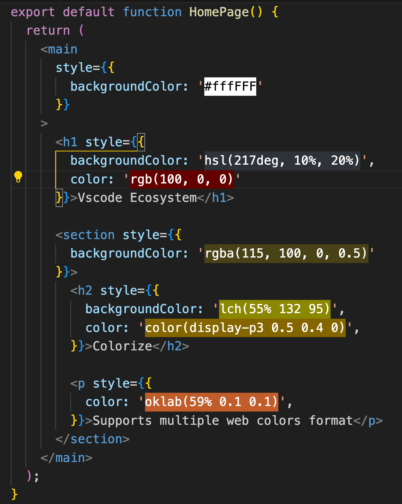

# Intro



Inspired by [vscode-ext-color-highlight by enyancc](https://github.com/enyancc/vscode-ext-color-highlight) which is not actively maintained.

The differences are:

1. Full refactor to `typescript`
2. Supports more color format
3. Only one config properties

## Commands

This extension contributes the following commands to the Command palette.

- `Toggle colorize`: enable or disable the web colors colorizer

## Configurations

To add or change keywords and other settings, <kbd>command</kbd> + <kbd>,</kbd> (or on Windows / Linux: File -> Preferences -> User Settings) to open the VSCode file `settings.json`.

```ts
interface ColorizeDefaultConfig {
  enabled: boolean
}

const colorizeDefaultConfig = {
  /**
   * Enable or disable the web colors decorations
   */
  enabled: true,
} satisfies ColorizeDefaultConfig
```