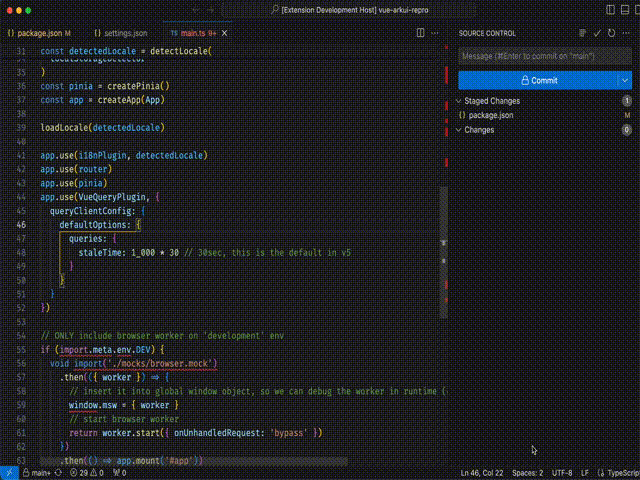

# Intro

Do you have a lot of `eslint-disable`, `@ts-ignore`, `@ts-expect-error`, `@ts-nocheck`, `istanbul ignore next`, etc..., but when you try to delete it using vscode built-in search and replace, it only deletes the text, and not the entire line?

This extension will instead deletes the line, instead of the text only. This will make your code cleaner without any unnecessary comments.

To delete all input text occurrences across the workspace:



## Commands

This extension contributes the following commands to the Command palette.

- `veco.deliner.deleteAll`: Delete lines based on the input text across the workspace

## Top-level Configuration

To add or change keywords and other settings, <kbd>command</kbd> + <kbd>,</kbd> (or on Windows / Linux: File -> Preferences -> User Settings) to open the VSCode file `settings.json`.

```ts
export interface DelinerDefaultConfig {
  include: string
  exclude: string
}

export const delinerDefaultConfig = {
  /**
   * Glob patterns that defines the files to search for.
   */
  include: '**/*.*',
  /**
   * Glob pattern that defines files and folders to exclude.
   */
  exclude: '**/{node_modules,bower_components,dev-dist,dist,build,html,coverage,out,.vscode,.vscode-test,.github,_output,.next}/**',
} satisfies DelinerDefaultConfig
```
