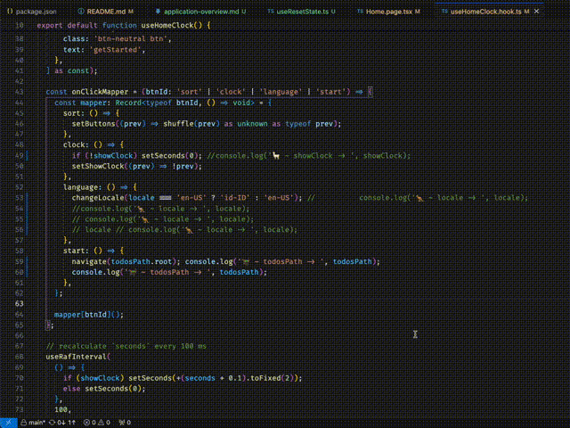

# Intro

Easily debug your Javascript code by automating the `console.log` statement. Supports inserting single or multiple log messages, comment out all log messages, uncomment all commented log messages, and delete all log messages.

## Commands

This extension contributes the following commands to the Command palette.

- `veco.logger.insert`: Insert log message (`alt+shift+i`)
- `veco.logger.comment`: Comment out all log messages (`alt+shift+c`)
- `veco.logger.uncomment`: Uncomment all commented log messages (`alt+shift+u`)
- `veco.logger.delete`: Delete all log messages (`alt+shift+d`)

## Inspirations

Also check these amazing extensions, which I used to use:

- [turbo-console-log by Chakroun-Anas](https://github.dev/Chakroun-Anas/turbo-console-log).