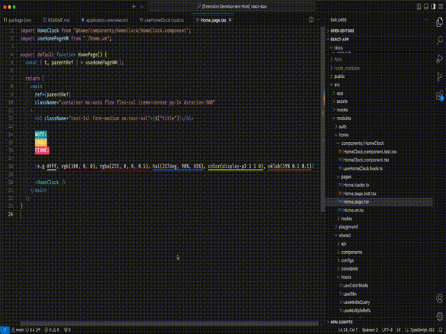
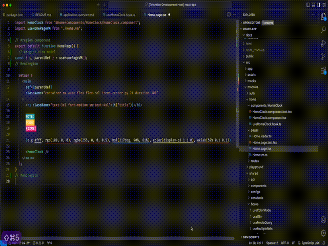
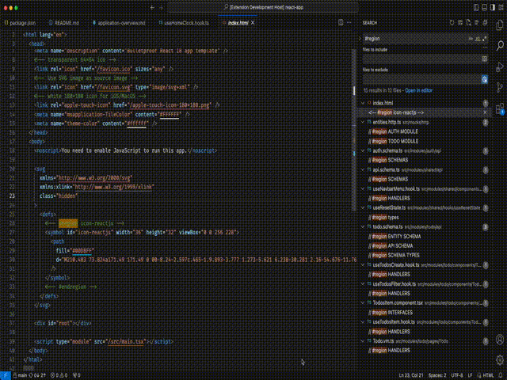

# Intro

[Folding and Region Folding](https://code.visualstudio.com/docs/editor/codebasics#_folding) is supported built-in by the vscode, but we as a developer need to manually write the "region" as comments. Comment formats are different based on the programming languages. This module will make it easy to insert, and delete region markers in various programming languages.

To Insert region marker comment:

To Delete all region marker occurrences in the current document:

To Delete all region marker occurrences across the workspace:

## Commands

This extension contributes the following commands to the Command palette.

- `veco.region.mark`: Insert region marker comment (`ctrl+m ctrl+r`)
- `veco.region.delete`: Delete all region marker occurrences in the current document (`ctrl+m ctrl+d`)
- `veco.region.deleteAll`: Delete all region marker occurrences across the workspace (`ctrl+m ctrl+a`)

## Inspirations

Also check these amazing extensions, which I used to use:

- [#region folding for VS Code by maptz](https://github.com/maptz/Maptz.VSCode.Extensions.customfolding).